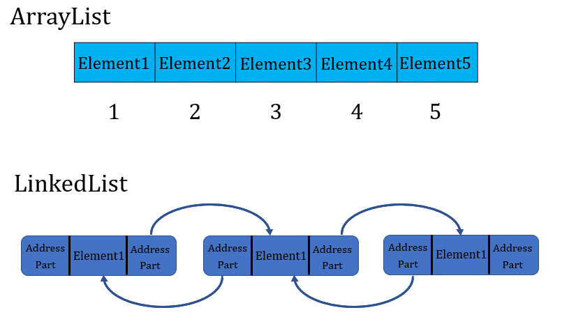
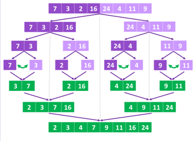
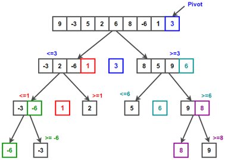
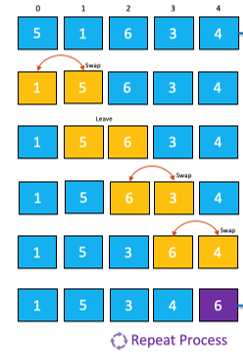
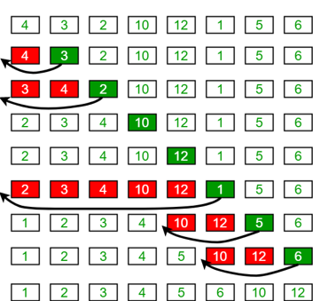

@mainpage Working with lists

 <b>The program supports work with <em>ArrayList</em> and <em>LinkedList</em>. </b>
 
The difference between these types of lists:

 *The following functions are available:*

 1) filling the list with a given number of arbitrary objects;

 2) adding an object to a specified place;

 3) removing an element from a specified place;

 4) finding the position of an element by its value and the value of an element by its position;

 5) sorting lists in ascending order. In particular, four types of sorting are available:

  &bull; <em>MergeSort</em>                    

               

  &bull; <em>QuickSort</em>

   

  &bull; <em>BubbleSort</em>

  

  &bull; <em>InsertionSort<em>

  